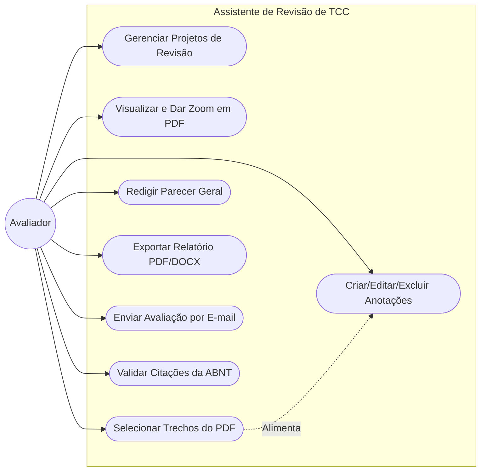
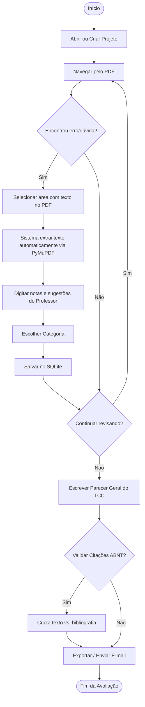
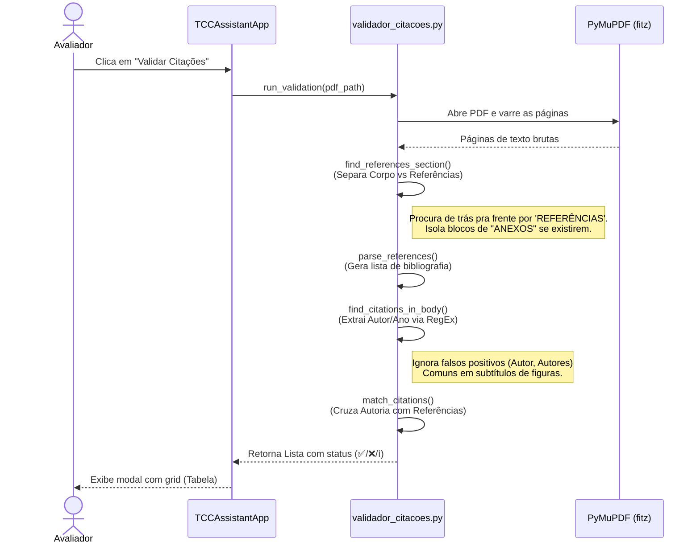
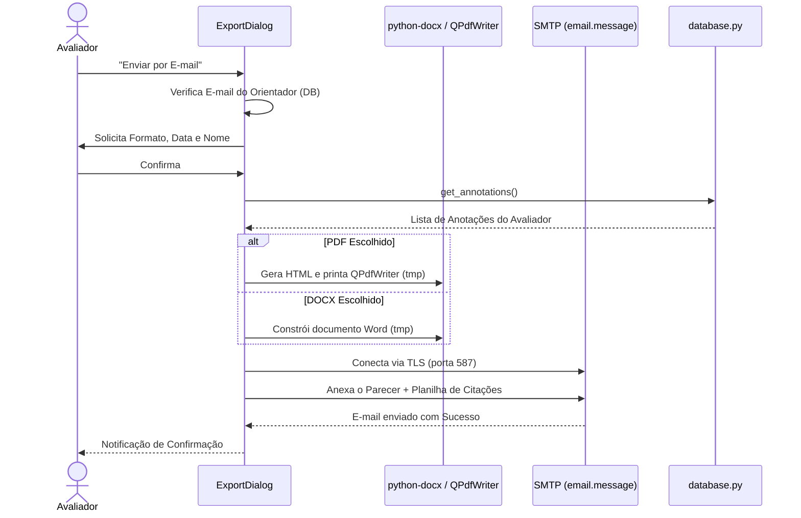
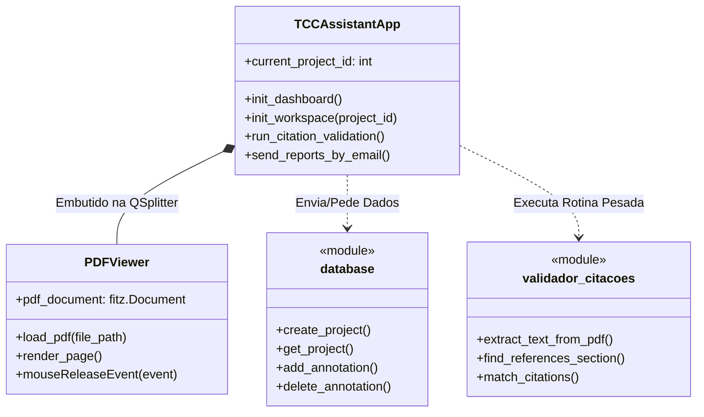

# Diagramas do Assistente de Revisão de TCC

Este documento apresenta diagramas que explicam a arquitetura e o fluxo de funcionamento profundo do **Assistente de Revisão de TCC**, incluindo UI, Banco de Dados e a Motor de Validação.

## 1. Diagrama de Casos de Uso

Representa as principais interações que o Avaliador (usuário) tem com o sistema.

## 2. Diagrama de Atividades: Fluxo Principal do Avaliador

Mostra o fluxo de trabalho típico, desde abrir o projeto até o envio do relatório.

## 3. Diagrama de Sequência: Motor Inteligente de Validação de Citações

Detalha como funciona o cruzamento entre as chamadas do texto vs a lista de referências quando o avaliador pressiona o botão de Validação.

## 4. Diagrama de Sequência: Exportação e Envio de E-mail

## 5. Arquitetura MVC Adaptada / Classes Base

